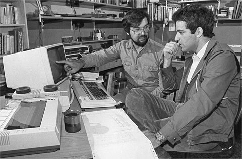
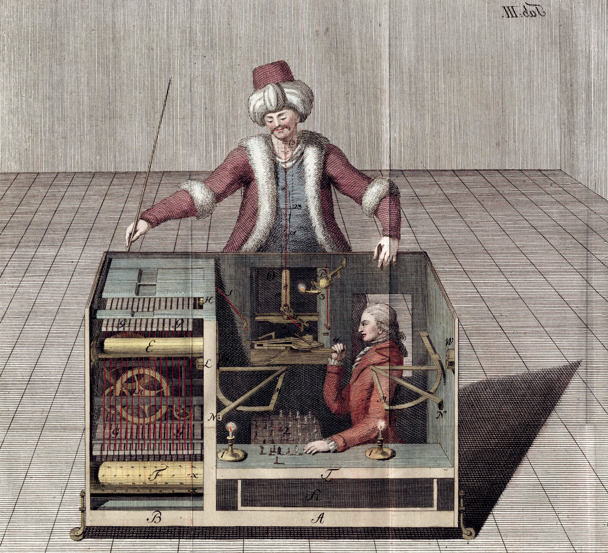
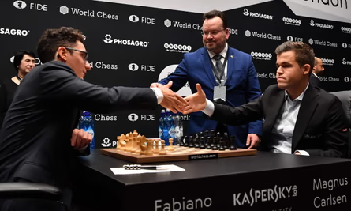

> *Каспаров, 1996 рік:* "Доки **я** граю, **комп'ютер не переможе** людину. У машини немає інтуіції, креативності. **Машина завжди матиме проблеми.**"



1997 року, чемпіон світу із шахів Гаррі Каспаров здається проти Deep Blue - найпотужнішому на той час шаховому комп'ютеру. Вперше чемпіон світу програв машині.



У цьому дослідженні я хотів дізнатися, як винахід шахових рушіїв змінив світ шахів. Наскільки талант втратив у ціні, наскільки люди стали краще грати загалом, і чи менше стало романтики. Гарного читання.

## Чи легше стало набирати рейтинг? (Convergence)

Головна гіпотеза цього дослідження у тому, що шахові комп'ютери демократизували шахи. Завдяки підготовці із рушієм, будь-який гравець може підготуватись до будь-якої пастки чи геніального плану під час опенінгу, і це нівелює частину таланту сильнішого гравця.

У серіалі Гамбіт Королеви, під час фінального матчу проти Спаського, ми можемо побачити, як відбувалась підготовка у еру до рушіїв. Десятки гросмейсрів з усієї країни могли працювати в команді, щоб підготувати свого кандидата до хоча б 10 ходів супротивника. Із рушіями зараз це робиться самостійно за пару годин.



Якщо це все правда, ми маємо побачити, що рейтинги гравців рангів #10–#100 підтягуються до лідерів швидше в «еру рушіїв» (після \~2000 року) — тобто розриви між позиціями мають скорочуватися.

Перевіряємо це через чотири взаємодоповнювальні графіки.

```{r setup}
#| message: false
#| warning: false

library(tidyverse)
library(zoo)

ratings <- read_csv(
  "D:/навчання/R/chess_engines_analysis/data/processed/ratings_combined.csv",
  show_col_types = FALSE
)

# One snapshot per (year, rank) — keep the latest available month
ratings_yearly <- ratings |>
  group_by(year, rank) |>
  slice_max(month, n = 1, with_ties = FALSE) |>
  ungroup()

# ── Consistent palettes used across all plots ──────────────────────────────
rank_palette <- c(
  "1"   = "#1b4332",
  "5"   = "#40916c",
  "10"  = "#52b788",
  "20"  = "#f4a261",
  "50"  = "#e76f51",
  "100" = "#c1121f"
)

decade_colors <- c(
  "1990s" = "#C05C2E",
  "2000s" = "#B03010",
  "2010s" = "#8B0000"
)
```

### Загальна динаміка рейтингів

```{r plot1}
#| fig-cap: "Рейтинги ключових позицій FIDE з 1967 по 2025 рік. Зглажено 3-річним ковзним середнім."

focal_ranks <- c(1, 5, 10, 20, 50, 100)

plot1_data <- ratings_yearly |>
  filter(rank %in% focal_ranks) |>
  arrange(rank, year) |>
  group_by(rank) |>
  mutate(rating_smooth = rollmean(rating, k = 3, fill = NA, align = "center")) |>
  ungroup() |>
  mutate(rank_label = paste0("#", rank),
         rank_label = factor(rank_label, levels = paste0("#", focal_ranks)))

last_points <- plot1_data |>
  filter(!is.na(rating_smooth)) |>
  group_by(rank_label) |>
  slice_max(year, n = 1) |>
  ungroup()

ggplot(plot1_data, aes(x = year, y = rating_smooth,
                       color = as.character(rank), group = rank)) +
  geom_line(linewidth = 0.9, na.rm = TRUE) +
  geom_text(
    data = last_points,
    aes(label = rank_label), hjust = -0.15, size = 3.2, fontface = "bold"
  ) +
  scale_color_manual(values = rank_palette, guide = "none") +
  scale_x_continuous(
    breaks = seq(1970, 2025, by = 10),
    expand = expansion(mult = c(0.02, 0.10))
  ) +
  scale_y_continuous(breaks = seq(2400, 2900, by = 50)) +
  labs(
    title    = "Рейтинги топ-позицій FIDE через час",
    subtitle = "Згладжування 3-річним ковзним середнім",
    x = NULL, y = "Рейтинг Elo"
  ) +
  theme_minimal(base_size = 13) +
  theme(panel.grid.minor = element_blank())
```

Усі позиції зростали. Частково через загальне покращення рівня гри, через більшу кількість літератури, більшу загальну кількість турнірів і тд. Але темп різний: #100 за весь період набрав близько 200 пунктів, тоді як #1 — лише \~125. Це перший сигнал конвергенції.

------------------------------------------------------------------------

### Приріст рейтингу по десятиліттях

Для кожного десятиліття та кожного рангу обчислюємо абсолютний приріст рейтингу. Якщо нижні позиції зростали *швидше за вищі — нахил лінії буде **позитивним** (нижчі ранги наздоганяють лідерів)*.

```{r plot2}
#| fig-cap: "Абсолютний приріст рейтингу по рангах за десятиліття. Позитивний нахил = нижчі ранги ростуть швидше."

# Compute avg rating in a ±2-year window around each decade boundary
decade_window <- function(data, center_yr) {
  data |>
    filter(year >= center_yr - 2, year <= center_yr + 2, rank <= 100) |>
    group_by(rank) |>
    summarise(avg_rating = mean(rating, na.rm = TRUE), .groups = "drop")
}

decades <- list(
  "1990s" = c(1990, 2000),
  "2000s" = c(2000, 2010),
  "2010s" = c(2010, 2020)
)

decade_data <- imap_dfr(decades, \(yrs, name) {
  start <- decade_window(ratings_yearly, yrs[1])
  end   <- decade_window(ratings_yearly, yrs[2])
  inner_join(start, end, by = "rank", suffix = c("_start", "_end")) |>
    mutate(delta = avg_rating_end - avg_rating_start, decade = name)
}) |>
  mutate(decade = factor(decade, levels = names(decades)))

# Extract slopes for inline text
slopes <- decade_data |>
  filter(!is.na(delta)) |>
  group_by(decade) |>
  summarise(slope = coef(lm(delta ~ rank))[["rank"]], .groups = "drop") |>
  deframe()

ggplot(decade_data, aes(x = rank, y = delta, color = decade)) +
  geom_point(alpha = 0.35, size = 1.2, na.rm = TRUE) +
  geom_smooth(method = "lm", se = FALSE, linewidth = 1.1, na.rm = TRUE) +
  scale_color_manual(values = decade_colors, name = "Десятиліття") +
  scale_x_continuous(breaks = c(1, seq(10, 100, 10))) +
  labs(
    title    = "Приріст рейтингу за десятиліття залежно від позиції",
    subtitle = "Позитивний нахил — нижчі ранги ростуть швидше за лідерів",
    x = "Ранг FIDE", y = "Приріст рейтингу (пунктів Elo)"
  ) +
  theme_minimal(base_size = 13) +
  theme(panel.grid.minor = element_blank(),
        legend.position = "right")
```

> "Сьогодні слабкий гравець із середнім комп'ютером може перемогти найсильнішого гросмейстера, якщо краще розуміє, як використовувати підказки машини" — Гаррі Каспаров під час візиту в Northeastern's D'Amore-McKim School of Business.

Нахили по десятиліттях:

-   **1990-ті:** `r round(slopes["1990s"] * 10, 1)` пунктів. Цікава річ, що сильніші гравці бенефітять від перших рушіїв більше. Перші "загальнодоступні" рушії це **Fritz, Junior та Shredder,** і це 2000ні роки. До цього усі комп'ютери це дуже обмежене задоволення, і тобі потрібні були багаті спонсори, щоб мати доступ до цієї технології.

    P.S. окрім рушіїв, важливим винаходом також стала датабаза ігор майстрів. Із нею можна було легше вивчити свого супротивника. Його репертуар, сильні і слабкі сторони. На фото нижче Гаррі Каспаров разом із співзасновником ChessBase — компанії, яка перша зробила таку датабазу. Каспарову навіть подарували її перший екземпляр із написом "00001"

    

-   **2000-ті:** `r round(slopes["2000s"] * 10, 1)` пунктів. Отут вже вийшли рушії на пентіумах, які міг використовувати майже кожен. Нижні позиції починають "наздоганяти" лідерів.

-   **2010-ті:** `r round(slopes["2010s"] * 10, 1)` пунктів. Engines стали стандартом, ніхто її не відкриває вперше, тобто і наздоганяти ніхто нікого не може. Система виходить у нову рівновагу.

P.S.: Звісно на цю конвергенцію вплинули і інші фактори. Наприклад у 2000х не було такого яскраво вираженого домінантного гравця. У 1990х це Каспаров, у 2010х це Карлсен.

Також різна кількість турнірів, менше турнірів open формату, де топові гравці могли зустрічатись із відносними середняками і тд (згадуйте серіал Гамбіт Королеви). Але це дослідження не може врахувати усі ці фактори. Все ще найкращі гравці світу згадують період 1990-2000 як перехід на еру рушіїв, а не "перехід на еру елітних турнірів", тому намагаємось дослідити саме це.

### Цікавий факт!!!

У рамках свого спонсорського контракту з компанією Atari у 1986 році Каспаров отримав понад 50 комп’ютерів, які він використав для створення першого комп’ютерного клубу в Радянському Союзі. Під час своїх міжнародних поїздок він продовжував підтримувати клуб, привозячи звідти додаткове обладнання та програмне забезпечення.


### Динаміка розривів між позиціями

```{r plot3}
#| fig-cap: "Розрив між #1 та нижчими позиціями з часом. Зглажено 3-річним ковзним середнім."

events <- tibble(
  year  = c(1997, 2006, 2017),
  label = c("Deep Blue\nперемагає\nКаспарова", "Ера Rybka", "AlphaZero")
)

gap_data <- ratings_yearly |>
  filter(rank %in% c(1, 5, 15, 50)) |>
  select(year, rank, rating) |>
  pivot_wider(names_from = rank, values_from = rating, names_prefix = "r") |>
  mutate(
    `#1 vs #5`  = r1 - r5,
    `#1 vs #15` = r1 - r15,
    `#1 vs #50` = r1 - r50
  ) |>
  select(year, `#1 vs #5`, `#1 vs #15`, `#1 vs #50`) |>
  pivot_longer(-year, names_to = "gap_type", values_to = "gap") |>
  arrange(gap_type, year) |>
  group_by(gap_type) |>
  mutate(gap_smooth = rollmean(gap, k = 3, fill = NA, align = "center")) |>
  ungroup() |>
  mutate(gap_type = factor(gap_type, levels = c("#1 vs #5", "#1 vs #15", "#1 vs #50")))

gap_palette <- c("#1 vs #5" = "#40916c", "#1 vs #15" = "#f4a261", "#1 vs #50" = "#c1121f")

ggplot(gap_data, aes(x = year, y = gap_smooth, color = gap_type)) +
  geom_line(linewidth = 0.95, na.rm = TRUE) +
  geom_vline(data = events, aes(xintercept = year),
             linetype = "dotted", color = "grey40", linewidth = 0.7) +
  geom_text(data = events, aes(x = year, y = Inf, label = label),
            inherit.aes = FALSE, vjust = 1.4, hjust = 0.5,
            size = 2.8, color = "grey30", lineheight = 0.85) +
  scale_color_manual(values = gap_palette, name = NULL) +
  scale_x_continuous(breaks = seq(1970, 2025, by = 5)) +
  scale_y_continuous(breaks = seq(0, 250, by = 25)) +
  labs(
    title    = "Розрив між #1 і нижніми позиціями",
    subtitle = "Якщо engines нівелюють різницю — розриви скорочуються",
    x = NULL, y = "Різниця рейтингів (пунктів Elo)"
  ) +
  theme_minimal(base_size = 13) +
  theme(panel.grid.minor = element_blank(),
        legend.position = "top")
```

На цьому графіку нас не так цікавить загальний тренд, скільки fluctuations. І найцікавіше та найбільш репрезентативне — зріст після поразки Каспарова DeepBlue, а далі різкий і досить довгий спад. Хтось скаже, що це через те, що Каспаров пішов із шахів, але це сталося 2005 року. А спад активний ще із 2000го. Вже відома нам дата, вихід Fritz, Junior та Shredder на пентіуми.

Далі із 2010го іде зріст. Чому? А тому що з'явився нови домінант — Магнус Карлсен. Саме у 2010му Магнус вперше посів перше місце серед найвищих рейтингів у світі. І довгий час тільки нарощував перевагу.

Далі знову невеликий спад із 2020, і це приблизно період коли Магнус заявив, що не отримує задоволення від гри в шахи, і трохи підзабив на кар'єру.

Загалом 2010 це вже період, коли всі були в рівних умовах, ніхто нікого не наздоганяв, тому приводити Magnus effect як аргумент є досить логічним.

------------------------------------------------------------------------

### Бонус: Пряме порівняння двох епох

```{r plot4}
#| fig-cap: "Різниця середніх рейтингів для кожного рангу між engine-ерою (2018–2024) та до-engine-ерою (1990–1996)."

safe_mean <- function(x) {
  if (length(x) == 0 || all(is.na(x))) NA_real_ else mean(x, na.rm = TRUE)
}

era_data <- ratings_yearly |>
  filter(rank <= 100) |>
  group_by(rank) |>
  summarise(
    engine_era = safe_mean(rating[year %in% 2018:2024]),
    pre_engine = safe_mean(rating[year %in% 1990:1996]),
    .groups = "drop"
  ) |>
  mutate(delta = engine_era - pre_engine) |>
  filter(!is.na(delta))

era_slope <- round(coef(lm(delta ~ rank, data = era_data))[["rank"]] * 10, 1)
first_delta <- round(era_data %>% 
                       filter(rank == 1) %>% 
                       pull(delta), 2)
last_delta <- round(era_data %>% 
                       filter(rank == 100) %>% 
                       pull(delta), 2)
ggplot(era_data, aes(x = rank, y = delta)) +
  geom_line(color = "#8B0000", linewidth = 0.8, alpha = 0.7) +
  geom_point(color = "#8B0000", alpha = 0.7, size = 1.8) +
  scale_x_continuous(breaks = c(1, seq(10, 100, 10))) +
  labs(
    title    = "Тест за двома епохами: до-engine vs engine",
    subtitle = "Y = середній рейтинг 2018–2024 мінус середній рейтинг 1990–1996",
    x = "Ранг FIDE", y = "Приріст рейтингу (пунктів Elo)"
  ) +
  theme_minimal(base_size = 13) +
  theme(panel.grid.minor = element_blank())
```

Тут одразу кілька цікавих аномалій.

Гравець #1 набрав лише **`r first_delta`** пунктів, тоді як #100 —**`r last_delta`**. Ранги #10–#20 показали максимальний приріст (\~110–112 пунктів). Чому?

Відповідь неоднозначна, є кілька різних пунктів:

-   Менше open турнірів. Якщо гравець 2750 грає у нічию із гравцем з рейтингом 2750, то вони нічого не втрачають. А якщо зустрітись із голодним до перемоги та дуже сухим в стилі гри гросмейстром 2500, і зіграти в нічию через засушений опенінг, це втрата великої кількості очків. У 2000х відкритих турнірів стало менше, а елітних більше, і це зменшило втрати рейтингу другим ешелоном.

-   Як раз демократизація гри. Топ 10-20 гравців мають величезний талант. Але у 1990х, у них не було великої команди для підготовки до турнірів, чи секретного доступу до датабаз або ранніх рушіїв. Зі стокфішем це все нівелювалось, і вивело другий ряд еліти вище.

-   Можливість засушити гру проти топів. Із рушіями, стало зрозуміло, що деякі опенінги граються відверто не на перемогу, а просто щоб зменшити гостроту позиції і звести все до нічиєї. І так топ 10-25 можуть триматися проти першої десятки більш достойно ніж раніше.

Чому топ 1 набрав так мало? Каспаров мав величезний відрив свого часу, як і Магнус. Скидається до двох домінантів. Топ 2 і 3 краще ілюструють демократизацію шахів, оскільки теж набрали небагато.

------------------------------------------------------------------------

### Підсумок секції

Чотири графіки підтверджують гіпотезу, але з важливим нюансом. Демократизація не була миттєвою: у 1990-х двигуни *збільшували* розрив, бо ними першими скористалися найсильніші.

Конвергенція почалася у 2000-х, коли другий ешелон мав змогу "наздогнати" топів за рівнем підготовки, і закінчилась у 2010х, коли рушії вже були у всіх і ніхто не наздоганяв жоден розрив.

Fritz, Junior та Shredder are the goats fr. Саме вони стали ледь не головним поштовхом до шахової революції.

------------------------------------------------------------------------

## Story time!!!

Насправді, перший шаховий рушій переміг Наполеона Бонапарта та Бенджаміна Франкліна, і їздив на гастролі по світу ще у 18му столітті.

Його називали "Механічний турк". Це була машина у вигляді чоловіка, що сидить за шаховим столом, яка механічними руками переставляла фігури та грала дуже сильні ігри.

Ніхто не розумів, як ця машина працює, як вона бачить позицію на дошці (про Computer vision тоді ще ніхто не знав) та розраховує ходи. Справжній штучний інтелект.

Він переміг Франкліна 1783го та Наполеона 1809го. Наполеон сказав, що насолодився грою, щоправда намагався кілька разів зіграти нелегальний хід. А Франклін взагалі став obsessed з турком.

Машина існувала з 1770го до 1854го, коли повністю згоріла в пожежі в музеї Пліні у Філадельфії, куди його зрештою продали.

Щоправда за три роки, 1857го, син останнього власника механічого турка опублікував серію викривальних статей у американському журналі The Chess Monthly, де розповів, що насправді всередині просто сидів дуже сильний гравець, і створював ілюзію, що грає машина. Чутки про це ходили протягом всього існування механізму. А отак це все виглядало:



## Хто крутіший: гросмейстер із 1980х чи 2010х?

Досить важливою частиною дослідження було питання інфляції шахових рейтингів із часом. Бо звісно гравців більше, турнірів більше, і загальний рівень гри росте.

Усі резултати до цього можна було навіть зіпхати на інфляцію, але я притримуюсь думки, що її не було.

Під час мого ресьорчу, я знайшов два основних джерела для обох позицій:

-   За інфляцію: <https://en.chessbase.com/post/rating-inflation-its-causes-and-poible-cures>

-   Проти інфляції: <https://centaur.reading.ac.uk/19778/1/Intrinsic_Rating.pdf>

Якщо хочете почитати, то дуже раджу, але якщо не маєте часу, то основним аргументом сторони за інфляцію є те, що людей із рейтингом 2700+ стало не 3, а 30.

Сторона проти інфляції пішла набагато глибше і провела аналіз, де аналізувала точність гравців різних рейтингових категорій із часом. Дослідження виявило, що точність майже ідентична, тому інфляція не підтверджена.

Я схилився саме до другої позиції, і вирішив провести зменшену версію такого аналізу на двох гравцях, які мені дуже подобаються: Таль і Раппорт. Обоє дуже агресивні, дуже креативні та романтичні в шаховому плані.

Це дослідження не є репрезентативним, проте було цікавим для мене в першу чергу. Обоє гравці на час цих ігор мають рейтинг приблизно 2700.

### Дані та статистичний тест

**Нульова гіпотеза (H0):** середній ACPL Таля та Рапопорта статистично не відрізняється (Regan & Haworth, 2011).

```{r acpl_stats}
#| message: false
#| warning: false

library(gt)

acpl_data <- read_csv(
  "../data/processed/tal_rapport_acpl.csv",
  show_col_types = FALSE
) |>
  filter(!is.na(acpl))

# Player palette — reused across all ACPL plots
player_palette <- c("Tal" = "#1b4332", "Rapport" = "#8B0000")

# ── Descriptive stats ──────────────────────────────────────────────────────
summary_stats <- acpl_data |>
  group_by(Гравець = player) |>
  summarise(
    N       = n(),
    Середнє = round(mean(acpl),   2),
    Медіана = round(median(acpl), 2),
    SD      = round(sd(acpl),     2),
    Min     = round(min(acpl),    2),
    Max     = round(max(acpl),    2),
    .groups = "drop"
  )

summary_stats |>
  gt() |>
  tab_header(title = "Описова статистика ACPL") |>
  cols_align("center", -Гравець) |>
  tab_style(
    style     = cell_text(weight = "bold"),
    locations = cells_column_labels()
  ) |>
  tab_style(
    style     = cell_text(color = "#2e7d32", weight = "bold"),
    locations = cells_body(rows = Гравець == "Tal")
  ) |>
  tab_style(
    style     = cell_text(color = "#c62828", weight = "bold"),
    locations = cells_body(rows = Гравець == "Rapport")
  ) |>
  opt_table_font(size = 13)
```

По таблиці із даними можемо сказати, що середні втраті сотих пішака (acpl) у гравців фактично рівні. Медіана у Таля менша, але стандартне відхилення більше. Він мав більше свободи в плані своєї гри, тому багато його ігор мають дуже високий acpl через ризиковані ходи. Раппорт так робити не міг через підготовку супротивників із рушіями.

```{r}
#| message: false
#| warning: false
tal_acpl     <- acpl_data$acpl[acpl_data$player == "Tal"]
rapport_acpl <- acpl_data$acpl[acpl_data$player == "Rapport"]

t_res  <- t.test(tal_acpl, rapport_acpl)

pooled_sd <- sqrt((var(tal_acpl) + var(rapport_acpl)) / 2)
cohens_d  <- (mean(tal_acpl) - mean(rapport_acpl)) / pooled_sd

tibble(
  Тест       = c("Welch t-test", "Cohen's d"),
  Значення = c(round(t_res$statistic, 3),
                 round(cohens_d, 3)),
  `p-value`  = c(format.pval(t_res$p.value,  digits = 3, eps = 0.001),
                 "—")
) |>
  gt() |>
  tab_header(title = "Статистичні тести") |>
  cols_align("center", -Тест) |>
  tab_style(
    style     = cell_text(weight = "bold"),
    locations = cells_column_labels()
  ) |>
  tab_style(
    style     = cell_fill(color = "#f5f5f5"),
    locations = cells_body(rows = c(1, 2))
  ) |>
  opt_table_font(size = 13)
```

По статистичних тестах, бачимо на t тесті височенний p value, тобто низьку статистичну значущість, а також d Коена надзвичайно низьке, що знову ж таки показує, що різниця між групами (гравцями у нас) є мінімальною.

### Розподіл ACPL

```{r acpl_density}
#| message: false
#| warning: false
#| fig-cap: "Розподіл ACPL за гравцем. Вертикальні пунктирні лінії — медіани."

med_lines <- acpl_data |>
  group_by(player) |>
  summarise(med = median(acpl), .groups = "drop")

ggplot(acpl_data, aes(x = acpl, fill = player, color = player)) +
  geom_density(alpha = 0.25, linewidth = 0.9) +
  geom_vline(
    data = med_lines,
    aes(xintercept = med, color = player),
    linetype = "dashed", linewidth = 0.8
  ) +
  scale_fill_manual(values  = player_palette, name = NULL) +
  scale_color_manual(values = player_palette, name = NULL) +
  labs(x = "ACPL", y = "Щільність") +
  theme_minimal(base_size = 13) +
  theme(panel.grid.minor = element_blank(),
        legend.position  = "top")
```

На цьому графіку можемо бачити, що у Таля більшість ігор мають трохи більшу точність ніж Раппорта, але також і гірших ігор (60+ acpl) теж більше.

Я вже згадував, що у Таля було більше свободи без підготовки суперників із рушіями, і часто з'являвся один із двох варіантів:

1.  Опонент не був готовий до жертви Таля, навіть якщо вона не була правильною, і робить помилку. Після помилки суперника грати набагато легше, отже і набирати високу точність.

2.  Опонент не повівся на жертву, і цей хід вже був помилкою Таля. Нижча точність.

> Існують два види жертв: правильні, і мої — Таль.

Також часто гру Таля описують як "він заводить супротивника в густий ліс, вихід із якого є тільки для одного. І це Таль". Короче його жертви не завжди правильні, але у більшості своїй дуже плутають супротивника, виводячи його на помилки.

Тобто не можна сказати, що Таль кращий гравець. Просто його стиль агресивніший, і це дозволялось у еру до рушіїв. А в середньому їхня гра фактично рівна.

## Чи стали люди грати в шахи краще?

Це наступна частина дослідження. Досить логічна гіпотеза: підготовка із рушіями покращує точність та якість гри. Але спочатку давайте скажемо, що таке "краще грати".

> Магнус Карлсен: "Я рідко граю проти рушіїв, тому що вони змушують мене почуватися таким дурним і марним"

Або інша його цитата:

> Якщо ви занадто багато граєте проти рушіїв, ваша власна креативність постраждає. Комп'ютер дорстоко каратиме більшість ваших творчих ідей. Все, що вам залишиться — це намагатися робити сух, механічно точні ходи, і якимось дивом уникати грубих помилок

Під "кращою" грою я маю на увазі саме таку, суху механічну, адже суто статистично вона точніша. Я не оцінюю наскільки було цікаво дивитися ці матчі абощо.

```{r wc_setup}
#| message: false
#| warning: false

library(ggrepel)

wc_games <- read_csv(
  "../data/processed/wc_acpl_per_game.csv",
  show_col_types = FALSE
) |>
  filter(!is.na(white_acpl), !is.na(black_acpl))

# Game-level combined ACPL
wc_games <- wc_games |>
  mutate(game_acpl = (white_acpl + black_acpl) / 2)

wc_games <- wc_games |>
  group_by(event, year) |>
  mutate(
    pair     = paste(pmin(white, black), pmax(white, black), sep = " vs "),
    n_pairs  = n_distinct(pair),
    is_match = (n_pairs == 1L) &
               !str_detect(event, "Rapid|25'|15'|g/25|g/15|Sudden Death|TB")
  ) |>
  ungroup() |>
  # Exclude forfeits / extremely short games (e.g. Fischer-Spassky 1972 game 2)
  mutate(is_classical_match = is_match & total_plies >= 30)

# Era labels
wc_games <- wc_games |>
  mutate(
    era = cut(
      year,
      breaks = c(1880, 1948, 1990, 2010, 2030),
      labels = c("Pre-modern", "Soviet", "Transition", "Engine"),
      include.lowest = TRUE
    )
  )

# Era palette
era_palette <- c(
  "Pre-modern"  = "#8B7355",
  "Soviet"      = "#A23B72",
  "Transition"  = "#F18F01",
  "Engine"      = "#2E86AB"
)

# Match-level aggregates (for plots 1 & 2) — classical games only
wc_matches <- wc_games |>
  filter(is_classical_match) |>
  group_by(match_id, year, era) |>
  summarise(
    match_mean_acpl = mean(game_acpl),
    n_games         = n(),
    .groups         = "drop"
  )

# Labels for key matches
key_years <- c(1972, 1985, 2018, 2024)
wc_labels <- wc_matches |>
  filter(year %in% key_years)
```

### Еволюція точності в матчах ЧС (1886–2024)

```{r wc_evolution}
#| message: false
#| warning: false
#| fig-width: 9
#| fig-height: 6
#| code-fold: true
#| fig-cap: "Середній ACPL по матчу. Менший ACPL — точніша гра. Розмір точки пропорційний кількості партій."
#| fig-format: svg

ggplot(wc_matches, aes(x = year, y = match_mean_acpl)) +
  geom_smooth(
    method  = "loess", span = 0.4,
    color   = "grey40", fill = "grey85",
    linewidth = 0.9, alpha = 0.35, se = TRUE
  ) +
  geom_point(
    aes(size = n_games, color = era),
    alpha = 0.85
  ) +
  geom_label_repel(
    data        = wc_labels,
    aes(label = year),
    size        = 3.2,
    box.padding = 0.4,
    min.segment.length = 0,
    color = "grey20"
  ) +
  scale_color_manual(values = era_palette, name = "Ера") +
  scale_size_continuous(range = c(2, 8), name = "Партій") +
  labs(x = NULL, y = "Середній ACPL матчу") +
  theme_minimal(base_size = 13) +
  theme(
    panel.grid.minor = element_blank(),
    legend.position  = "right",
    plot.background  = element_rect(fill = "transparent", color = NA),
  panel.background = element_rect(fill = "transparent", color = NA),
  legend.background = element_rect(fill = "transparent", color = NA),
  text  = element_text(color = "grey50"),
  axis.text = element_text(color = "grey50")
  )
```

Можемо дуже чітко бачити спадний тренд. Хіба перехідний період трішки виділяється, але це одиничні матчі, далі знову йде спад.

Можна також побачити що із 2018 до 2024 вже йде зріст, і це приблизно час коли Манус перестав грати в фіналах ЧС.

### Mini story time!!!

На графіку видно, що матч 2018 року має найменший acpl. Саме цього року відбувся легендарний матч Магнус Карлсен - Фабіано Кауана, який завершився 12ма практично ідеальними нічиїми.

Переможець визначався у рапідних іграх як тайбрейкері, і ним вийшов Магнус.

Проте Каруана вразив увесь світ, не програвши Магнусу жодної класичної гри.



### Розподіл за ерами

```{r wc_eras}
#| message: false
#| warning: false
#| fig-width: 9
#| fig-height: 6
#| code-fold: true
#| fig-cap: "Розподіл ACPL по матчах у розрізі епох."

ggplot(wc_matches, aes(x = era, y = match_mean_acpl, color = era)) +
  geom_boxplot(
    outlier.shape = NA,
    width = 0.45, linewidth = 0.8,
    fill  = NA
  ) +
  geom_jitter(
    aes(size = n_games),
    width = 0.18, alpha = 0.75
  ) +
  scale_color_manual(values = era_palette, guide = "none") +
  scale_size_continuous(range = c(2, 7), name = "Партій") +
  labs(x = NULL, y = "Середній ACPL матчу") +
  theme_minimal(base_size = 13) +
  theme(
    panel.grid.minor  = element_blank(),
    panel.grid.major.x = element_blank(),
    legend.position   = "right"
  )
```

Минулий тренд просто підтвердився. Цікаво, що в еру переходу абсоютна більшість ігор пройшли на точності приблизно 12 acpl, і на графіку медіана та 75й персентиль майже співпадають.

### Точність чемпіонів

```{r wc_players}
#| message: false
#| warning: false
#| fig-width: 9
#| fig-height: 6
#| code-fold: true
#| fig-cap: "ACPL гравців у матчах ЧС за роком першої появи"

# Champions / top-tier players to label
label_names <- c(
  "Steinitz", "Lasker", "Capablanca", "Alekhine", "Botvinnik",
  "Smyslov", "Tal", "Petrosian", "Spassky", "Fischer",
  "Karpov", "Kasparov", "Kramnik", "Anand", "Topalov",
  "Carlsen", "Ding", "Gukesh"
)

# Build per-player stats: each player appears as White or Black
wc_player_white <- wc_games |>
  filter(is_classical_match) |>
  select(player = white, year, era, acpl = white_acpl)

wc_player_black <- wc_games |>
  filter(is_classical_match) |>
  select(player = black, year, era, acpl = black_acpl)

player_stats <- bind_rows(wc_player_white, wc_player_black) |>
  group_by(player) |>
  summarise(
    n_matches  = n_distinct(year),
    mean_acpl  = mean(acpl, na.rm = TRUE),
    first_year = min(year),
    first_era  = as.character(first(era[year == min(year)])),
    .groups    = "drop"
  ) |>
  mutate(
    last_name = str_extract(player, "^[^,]+"),
    do_label  = last_name %in% label_names
  )

ggplot(player_stats, aes(x = first_year, y = mean_acpl)) +
  geom_smooth(
    method = "loess", se = FALSE,
    color = "grey55", linewidth = 0.9, alpha = 0.3
  ) +
  geom_point(aes(color = first_era, size = n_matches), alpha = 0.85) +
  geom_label_repel(
    data        = filter(player_stats, do_label),
    aes(label   = last_name, color = first_era),
    size        = 3,
    box.padding = 0.4,
    min.segment.length = 0.2,
    show.legend = FALSE
  ) +
  scale_color_manual(values = era_palette, name = "Перша ера") +
  scale_size_continuous(range = c(2, 8), name = "Матчів") +
  labs(x = "Рік першої появи в матчах ЧС", y = "Середній ACPL") +
  theme_minimal(base_size = 13) +
  theme(
    panel.grid.minor = element_blank(),
    legend.position  = "right"
  )
```

Тут можемо побачити "аутлаєри". Капабланка у 1920х зіграв на рівні Спасського через 40 років. Не дарма легенда шахів.

І звісно найнижчі точки це Магнус Карлсен.

### Висоновок секції

Гіпотеза підтвердилась. Із плином часу, більшою кількістю літератури, а потім рушіїв, люди почали грати в шахи краще.

Принаймні точніше.

## Guess the Elo against my model!!!

```{=html}
  <iframe 
     src="https://akondratok-guess-the-elo-against-ai.hf.space?embed=true" 
     width="100%" 
     height="700" 
     frameborder="0">
  </iframe>
```

Guess the Elo це популярна гра в шаховому ком'юніті, здебільшого завдячуючи GothamChess. Мета гри — вгадати середній рейтинг двох гравців, глянувши на їхню гру. Тут ви можете зіграти в цю гру із 200 іграми з лічесу, і позмагатися проти моєї модельки, яка натренована вгадувати середній рейтинг на точності гравців, різних часових фічах та паттернових.

Удачі, та дякую, що почитали це :)
